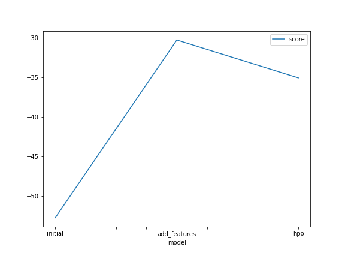
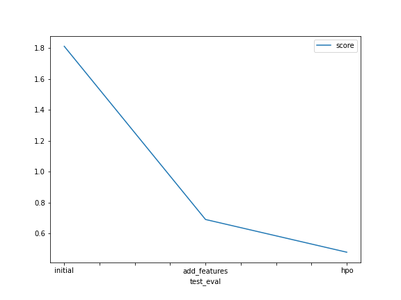

# Report: Predict Bike Sharing Demand with AutoGluon Solution
#### JORGE FUENTES PACHECO

## Initial Training
### What did you realize when you tried to submit your predictions? What changes were needed to the output of the predictor to submit your results?
Negative predictions had to be converted to zero

### What was the top ranked model that performed?
The top ranked model was WeightedEnsemble_L3 in all cases (initial model, model with new features, and model with new features and hyperparameters  )

## Exploratory data analysis and feature creation
### What did the exploratory analysis find and how did you add additional features?
Exploratory analysis provided insight into the distribution of the data. Additional features were obtained from the 'datetime' instance. The new variables were day, hour, month, and year.

### How much better did your model preform after adding additional features and why do you think that is?
The addition of new features improved the performance of the model. The score went from 1.81149 to 0.69001. The features are key elements for better prediction.

## Hyper parameter tuning
### How much better did your model preform after trying different hyper parameters?
When I added a hyperparameter setting the model improved its performance even more, but in other cases it did not.
### If you were given more time with this dataset, where do you think you would spend more time?
With certain hyperparameter I got errors during training, so I would have to invest more time in getting to know in depth each of the hyperparameters available by the function.

### Create a table with the models you ran, the hyperparameters modified, and the kaggle score.
|model|hpo1|hpo2|hpo3|score|
|--|--|--|--|--|
|initial|time_limit = 600|presets='best_quality'|X|1.81149|
|add_features|time_limit = 600|presets='best_quality'|X|0.69001|
|hpo|time_limit = 600|presets='best_quality'|gbm_options|0.47810|

### Create a line plot showing the top model score for the three (or more) training runs during the project.

### Create a line plot showing the top kaggle score for the three (or more) prediction submissions during the project.

## Summary

With this project I was able to have my first approach to Amazon SageMaker Studio. I was able to train a regression model using the TabularPredictor class from the AutoGluon library. The database used was Bike Sharing Demand, in which the creation of new features and the use of different hyperparameters to optimise the model were analysed in order to improve the performance of the models. At the end I made a report of the results with graphs and tables.